# ZPKG_BASE64_ENCODE_DECODE
SAP BTP CPI - BASE64_ENCODE_DECODE


---

<br>

# :building_construction: Arquitetura do iFlow

## 🔄 1. Fluxo da Integração

<br>

### Criando o Package


<br><br>

### Nome do Package
```
ZPKG_BASE64_ENCODE_DECODE
```
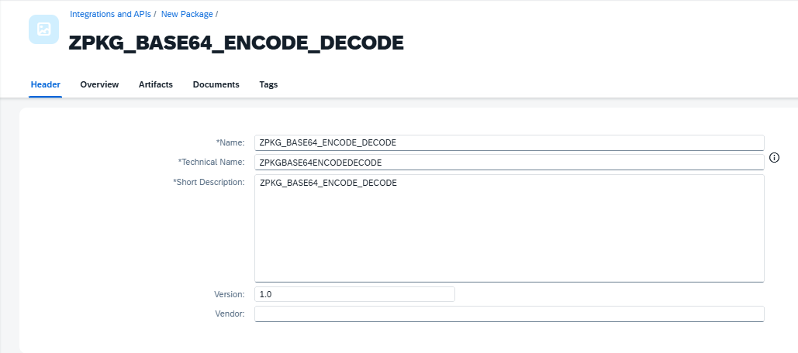

<br>

## 🧩 2. Criação do Integration Flow

<br>

### Adicionando o Artefato
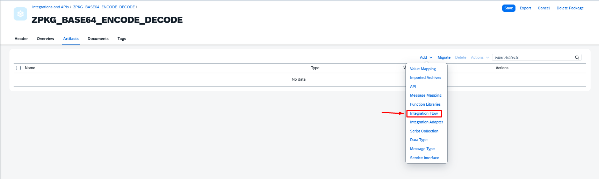

<br>

### Nome do iFlow
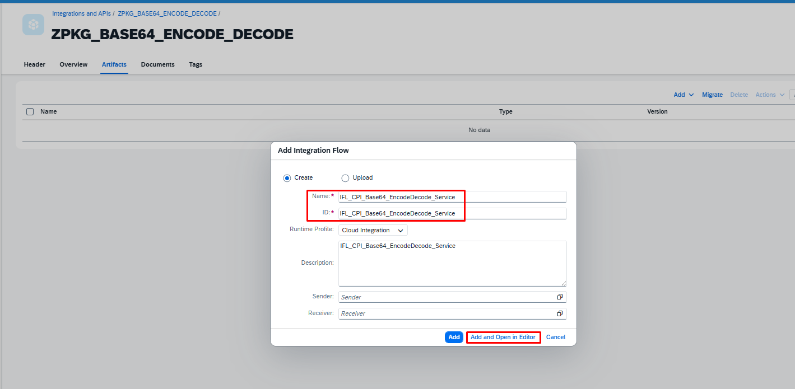
```
IF_CPI_Base64_EncodeDecode_Service
```
<br>

## ⚙️ 3. Configuração do Adapter HTTPS

### Adicionando o Adapter

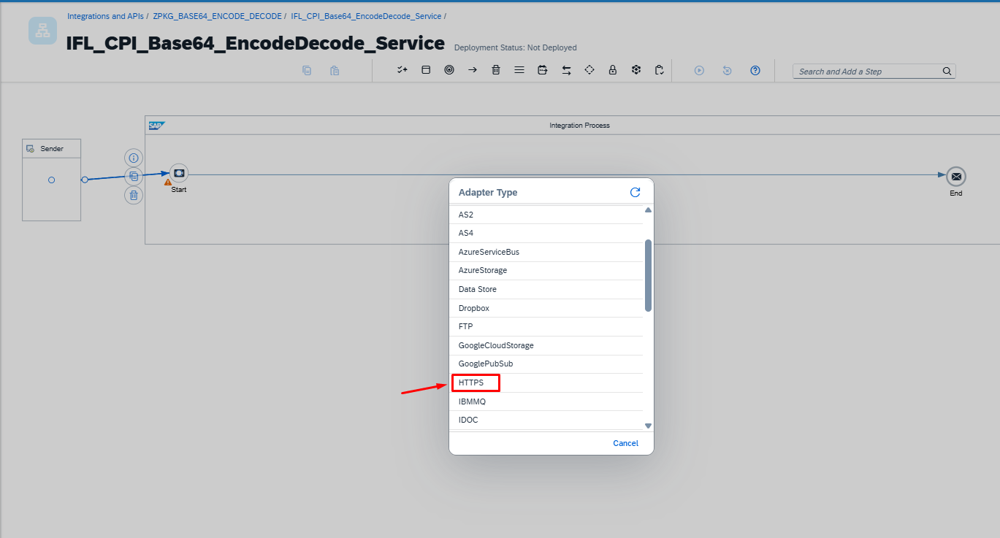

<br>

## 🌐 3. Configuração do Adapter HTTPS

### Trigger (HTTPS)

```
Adapter: HTTPS
Method: GET ou POST
Endpoint:
/download-anexo
```
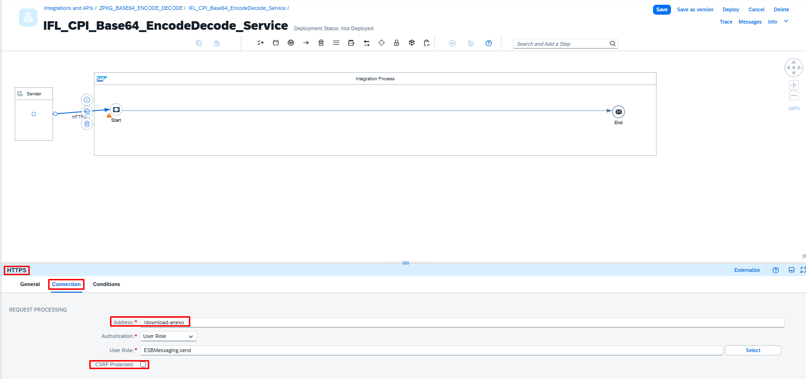

<br>

## ⚙️ 4.Content Modifier

### Adicionando o Content Modifier
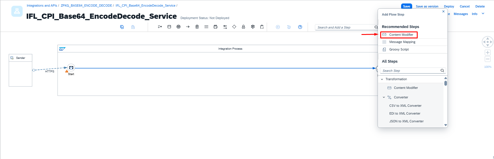

<br>

### Renomeando o Content Modifier
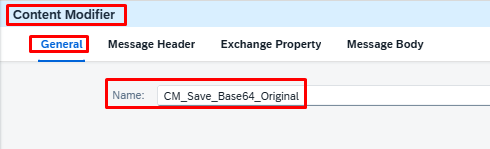
```
Name: CM_Save_Base64_Original
```

<br>

### Configurando o Content Modifier
```
Name: CM_Save_Base64_Original
Exchange Property
Name: base64_original
Source Type: Expression
Source Value: ${body}
Data Type: java.lang.String
```
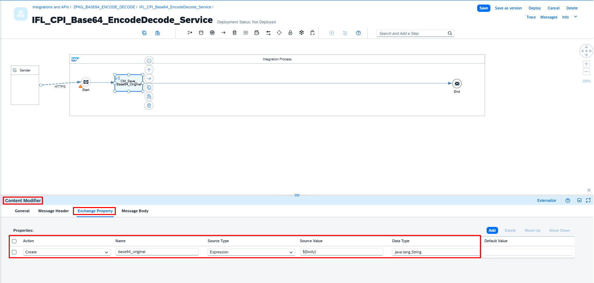

<br>

## ⚙️ 5.Content Modifier

### Adicionando o Content Modifier
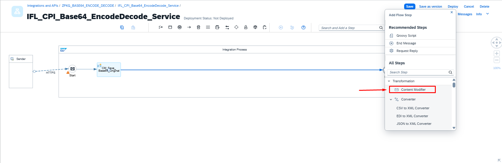

<br>

### Renomeando o Content Modifier
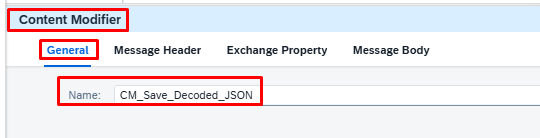
```
Name: CM_Save_Decoded_JSON
```

<br>

### Configurando o Content Modifier
```
Name: CM_Save_Decoded_JSON
Exchange Property
Name: decoded_body
Source Type: Expression
Source Value: ${body}
Data Type: java.lang.String
```
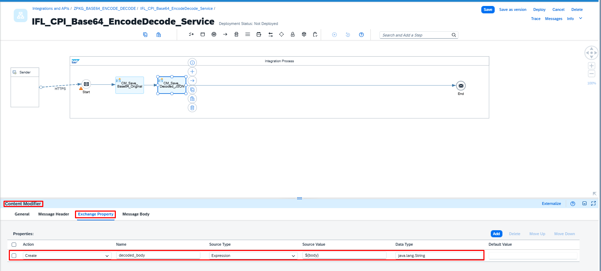

<br>

## ⚙️ 6. Groovy Script
### Adicionando o Groovy Script
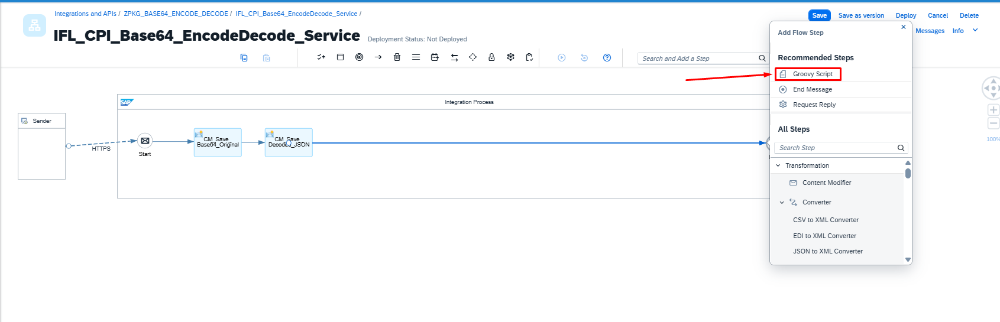

<br>

### Renomeando o Groovy Script
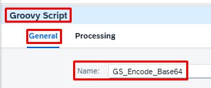

```
Name: GS_Encode_Base64
```

<br>

### Adicionando o Groovy Script
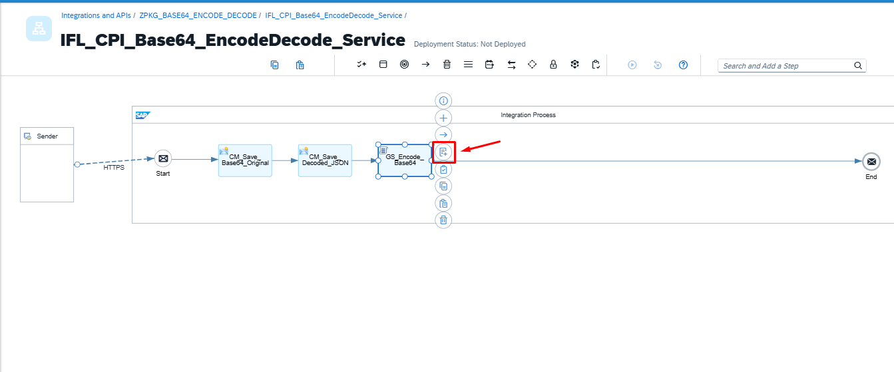

<br>

### Código do Groovy Script
```
import com.sap.gateway.ip.core.customdev.util.Message
import java.util.Base64

def Message processData(Message message) {
    
    def body = message.getBody(String)
    
    def encoded = Base64.getEncoder().encodeToString(body.getBytes("UTF-8"))
    
    message.setBody(encoded)
    
    return message
}
```
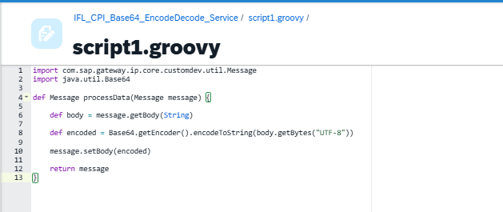

<br>


### Entrada no Postman

## 🌐 🔹 1.POSTMAN
```
{
  "id": 1,
  "title": "TESTE",
  "body": "TESTANDO"
}
```

## 🧩 🔧 iFlow COMPLETO (Baseado nessa JSON)


⚙️ 3. Base64 Decoder
```
Name: CV_Base64_Decode
```


⚙️ 5. Content Modifier
```
Name: CM_Save_Encoded_Base64
Exchange Property
Name: encoded_body
Source Type: Expression
Source Value: ${body}
Data Type: java.lang.String
```

⚙️ 6. Content Modifier
```
Name: CM_Build_Final_Response
```

```
Type: Expression
Body: 
{
  "base64_original": "${property.base64_original}",
  "decoded": ${property.decoded_body},
  "encoded_again": "${property.encoded_body}"
}
```

🎯 Resultado

```
{
  "base64_original": "eyJpZCI6MSwidGl0bGUiOiJURVNURSIsImJvZHkiOiJURVNUQU5ETyJ9",
  "decoded": {
    "id": 1,
    "title": "TESTE",
    "body": "TESTANDO"
  },
  "encoded_again": "eyJpZCI6MSwidGl0bGUiOiJURVNURSIsImJvZHkiOiJURVNUQU5ETyJ9"
}
```


